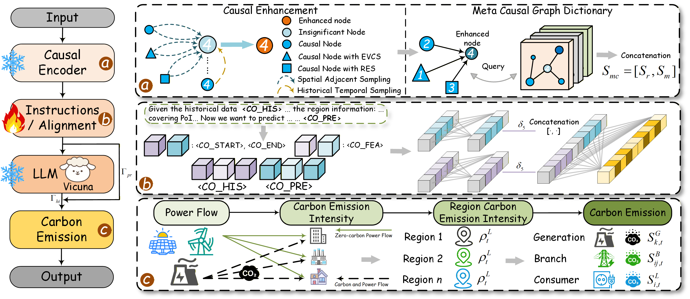

# CarbonGPT: Meta Causal Graph Large Language Models for Carbon Emission Forecasting in Large-scale Power Distribution Networks

Shijie Li, Jiajun Lai, Jing Li, Wenhu Tang, Ying Xue, Huaiguang Jiang*  (*Corresponding author)<br />

[School of Future Technology](https://www2.scut.edu.cn/ft/main.htm), @[South China University of Technology](https://www.scut.edu.cn/en/)

-----

## Abstract

<p style="text-align: justify">
*Carbon emission reduction has emerged as a global core development objective, where dynamic carbon flow perception serves as the critical foundation for low-carbon dispatch. However, the electrification shift of transportation carbon emissions caused by large-scale electric vehicle (EV) grid integration, coupled with the grid impact from renewable energy source (RES) volatility, poses unprecedented challenges for accurate carbon emission prediction. Although adaptive graphs and large language models (LLMs) can achieve carbon emission prediction for power distribution networks (PDNs) under data sparsity scenarios, the spurious cross-variable correlations derived from their adaptive topologies tend to be amplified by LLMs, consequently constraining model learning and reasoning capabilities. To address this, we propose a novel model named CarbonGPT. This innovative model employs a causal encoder to uncover genuine cross-variable causal relationships, while incorporating a meta causal graph dictionary and lightweight alignment to enhance the comprehension of carbon feature representations by LLMs under EV and RES grid integration scenarios. Extensive simulations in PDNs with high penetration of EVs and RES integration have demonstrated that CarbonGPT consistently achieves state-of-the-art performance in both prediction accuracy and effectiveness.*
</p>




## Introduction of Our Model

* To accurately predict carbon emissions in PDNs under extensive integration of EVCS and RES, we introduce a carbon emission LLM (i.e., CarbonGPT), which leverages causal inference to effectively extract real spatio-temporal features across variables in sparse data.
* To effectively identify and eliminate spurious cross-variable correlations in the adaptive spatial structure of PDNs, we specifically design variable embedding, causal inference, and causal enhancement within the causal encoder. These components ensure the preservation of independent variable features while uncovering cross-variable causal relationships to guide the LLM in learning the carbon emission patterns of PDNs.
* To fully leverage the powerful LLM in adapting to sparse PDN data and aligning with the continuous value distribution of carbon emissions, we introduce a meta causal graph dictionary and lightweight marker alignment. These are designed to assist the LLM in understanding the carbon feature representations of PDNs after causal enhancement, based on the characteristics of EVCS and RES.
* To closely simulate realistic PDNs under extensive integration of EVCS and RES, we propose the RPTM, which constructs a large-scale PTN with high RES penetration through density-based spatial clustering (DSC), dual-network threshold fusion, and traffic-to-charge (T2C). The proposed CarbonGPT achieves state-of-the-art (SOTA) performance within the PTN.

## Getting Started

<span id='all_catelogue'/>

### Table of Contents:

* <a href='#Environment'>1. Environment </a>
* <a href='#Training CarbonGPT'>2. Training CarbonGPT </a>
  * <a href='#Prepare Pre-trained Checkpoint'>2.1. Prepare Pre-trained Checkpoint</a>
  * <a href='#Instruction Tuning'>2.2. Instruction Tuning</a>
* <a href='#Evaluating CarbonGPT'>3. Evaluating CarbonGPT</a>
  * <a href='#Preparing Checkpoints and Data'>3.1. Preparing Checkpoints and Data</a>
  * <a href='#Running Evaluation'>3.2. Running Evaluation</a>
  * <a href='#Evaluation Metric Calculation'>3.3. Evaluation Metric Calculation</a>
* <a href='#Carbon Emission Flow'>4. Carbon Emission Flow</a>
  * <a href='#Preparing Checkpoints and Data'>4.1. Power Flow</a>
  * <a href='#Preparing Data'>4.2. Preparing Data </a>
  * <a href='#Carbon Emission Rate and Carbon Emission Intensity'>4.3. Carbon Emission Rate and Carbon Emission Intensity</a>

****


<span id='Introduction to the PTN'/>

### 1. Introduction to the PTN

To evaluate the effectiveness of the proposed CarbonGPT in predicting carbon emissions under large-scale integration of EVCS and RES, we constructed the PTN, as illustrated in \cref{fig:ptn}. Specifically, due to data privacy constraints, obtaining the real structure and related data of the PDN and UTN within a specific region is highly challenging. Inspired by~\citep{Shijie2024}, we utilize the proposed novel RPTM to allocate real winter load data and RES data from 22 neighboring small areas to the three feeder nodes of the IEEE 8500-node test feeder~\citep{5484381}, thereby constructing a large-scale PDN that closely approximates reality. Subsequently, we couple the UTN~\citep{UTD19} with the PDN~\citep{pfenninger2016long} from two regions that have similar weather, economic conditions, electricity consumption habits, and driving habits, using the RPTM to form a complete large-scale PTN dataset. Detailed information on the data sources and selection methods can be found at \textcolor{blue}{https://github.com/lishijie15/CarbonGPT}. Notably, the RPTM operates independently from CarbonGPT.


Due to legal and privacy protection constraints, acquiring diverse data sources including PDS structure, long-term PDS state data, UTS structure, and long-term traffic flow data for a specific large-scale region in reality is challenging~\cite{IOTJ2020}. Currently, none of publicly available datasets cover both PDS and UTS information for the same area. Certain scholars have merged analogous power and traffic systems to create the PTS~\cite{zhang2019yen}. Nevertheless, the resulting system is relatively limited in scale and deviates substantially from real-world PDSs~\cite{su2020integration}. To address this issue, this paper selects the IEEE 8500-node test feeder and the UTD19 dataset as the data sources for the PDS and UTS, respectively, and fuses them to construct a large-scale PTS. 

Specifically, various regions exhibit significant differences in climate conditions, user electricity consumption habits, driving habits, and EV penetration rates. These factors greatly affect the distribution of load peaks and valleys. To ensure the authenticity of the coupled system, the data for the PDS is sourced from cities in Colorado, specifically from the U.S. Building End-Use Load Profiles dataset~\cite{frick2019end}. Regarding the UTS, economically developed regions with a mild climate and a significant scale of EVs are more representative in simulating the impact of numerous EVs integrating to the PDS. Therefore, we select the traffic flow data from the Hamburg region in Germany~\cite{UTD19}. The topology of both the PDS and the UTS is shown in Fig.~\ref{fig:power_utd}, with these two regions characterized by similar economic and climatic conditions. These areas share comparable EV penetration rates and require substantial heating in the winter, leading to high and fluctuating winter loads. Moreover, there is a noticeable decrease in the range of EVs during winter~\cite{hao2020seasonal}. Thus, the winter data better represents the PTS we constructed and facilitates the analysis of the impact of the fluctuating frequency of EV charging on the PDS.

By fusing multi-source spatio-temporal information within the designated region as described above, it becomes possible to construct a large-scale PTS that couples the topological structures of both systems, as illustrated in the accompanying Fig.~\ref{fig:power_utd}. Additionally, the EVCSs are identified as red intersection points within the PTS. In the data preprocessing phase, we eliminate PDS loads with lower power that do not conform to the structure of the IEEE-8500 node test feeder. Subsequently, the samples are allocated to their respective nodes according to the linked feeder from the dataset, ensuring that the power of each node meets the requirements of the case study. Finally, the principle of closest proximity is utilized to select the coupling nodes, thereby eliminating any anomalous EVCS. The data is split into training, validation, and testing sets using a ratio of 7:1:2.


<span id='Environment'/>

### 2. Environment

Please first clone the repo and install the required environment, which can be done by running the following commands:

```shell
conda create -n CarbonGPT python=3.9.13

conda activate CarbonGPT

# Torch with CUDA 11.8
pip install torch==2.0.1 torchvision==0.15.2 torchaudio==2.0.2

# To support vicuna base model
pip3 install "fschat[model_worker,webui]"

# To install pyg and pyg-relevant packages
pip install torch_geometric
pip install pyg_lib torch_scatter torch_sparse torch_cluster torch_spline_conv -f https://data.pyg.org/whl/torch-2.0.1+cu118.html

# Clone our CarbonGPT or download it
git clone https://github.com/lishijie15/CarbonGPT.git
cd CarbonGPT

# Install required libraries
# (The recommendation is to install separately using the following method)
pip install deepspeed
pip install ray
pip install einops
pip install wandb
pip install flash-attn==2.3.5
pip install transformers==4.34.0

# （or you can install according to the requirements file.）
pip install -r requirements.txt
```

- All neural networks are implemented using PyTorch and trained on 8 NVIDIA A800 80GB GPUs / 8 NVIDIA H100 80GB GPUs.

<span id='Training CarbonGPT'/>

### 2. Training CarbonGPT

<span id='Prepare Pre-trained Checkpoint'/>

#### 2.1. Preparing Pre-trained Checkpoint

CarbonGPT is trained based on following excellent existing models.
Please follow the instructions to prepare the checkpoints.

- `Vicuna`:
  Prepare our base model Vicuna, which is an instruction-tuned chatbot and base model in our implementation. Please download its weights [here](https://github.com/lm-sys/FastChat#model-weights). We generally utilize v1.5 and v1.5-16k model with 7B parameters. You should update the 'config.json' of vicuna, for example, the 'config.json' in v1.5-16k can be found in [config.json](https://huggingface.co/datasets/bjdwh/checkpoints/blob/main/train_config/config.json)

- `Causal Encoder`:
  
  we specifically design the lightweight causal inference and intervention mechanism named causal intervention encoder. This is integrated with multi-scale temporal feature extraction modules to help the encoder enable the LLM to understand and learn complex spatio-temporal evolution patterns. The weights of [causal_encoder](./checkpoints/causal_encoder/pretrain_causalencoder.pth) are pre-trained through a typical multi-step spatio-temporal prediction task.
  
- `PTN Data`:

  To evaluate the effectiveness of the proposed model in predicting spatio-temporal patterns across different scenarios, we have constructed two distinct scale scenarios. Scenario 1 involves net load forecasting for large-scale PDNs, considering the integration of substantial Renewable Energy Sources (RES). Scenario 2 focuses on traffic flow prediction, taking into account factors such as crime rates. These data are organized in [train_data](./CarbonGPT/ST_data_CarbonGPT/train_data). Please download them and put them at ./CarbonGPT/ST_data/train_10pv

<span id='Instruction Tuning'/>

#### 2.2. Instruction Tuning 

* **Start tuning:** After the aforementioned steps, you could start the instruction tuning by filling blanks at [CarbonGPT_train.sh](./CarbonGPT_train.sh). There is an example as below: 

```shell
# to fill in the following path to run our CarbonGPT!
model_path=./checkpoints/vicuna-7b-v1.5-16k
instruct_ds=./ST_data/train_10pv/train_10pv_withUTN.json
st_data_path=./ST_data/train_10pv/train_pv10_withUTN.pkl
pretra_ste=Causal_Encoder
output_model=./checkpoints/Causal_Encoder_7b_pv10

wandb offline
python -m torch.distributed.run --nnodes=1 --nproc_per_node=8 --master_port=20001 \
    CarbonGPT/train/train_power.py \
    --model_name_or_path ${model_path} \
    --version v1 \
    --data_path ${instruct_ds} \
    --st_content ./TAXI.json \
    --st_data_path ${st_data_path} \
    --st_tower ${pretra_ste} \
    --tune_st_mlp_adapter True \
    --st_select_layer -2 \
    --use_st_start_end \
    --bf16 True \
    --output_dir ${output_model} \
    --num_train_epochs 3 \
    --per_device_train_batch_size 4 \
    --per_device_eval_batch_size 4 \
    --gradient_accumulation_steps 1 \
    --evaluation_strategy "no" \
    --save_strategy "steps" \
    --save_steps 4800 \
    --save_total_limit 1 \
    --learning_rate 2e-3 \
    --weight_decay 0. \
    --warmup_ratio 0.03 \
    --lr_scheduler_type "cosine" \
    --logging_steps 1 \
    --tf32 True \
    --model_max_length 2048 \
    --gradient_checkpointing True \
    --lazy_preprocess True \
    --report_to wandb
    
```

<span id='Evaluating CarbonGPT'/>

### 3. Evaluating CarbonGPT

<span id='Preparing Checkpoints and Data'/>

#### 3.1. Preparing Checkpoints and Data 

* **Checkpoints:** You could try to evaluate CarbonGPT by using your own model or our released checkpoints.
* **Data:** We split test sets for Scenario 1 and Scenario 2 datasets and make the instruction data for evaluation. Please refer to the [evaluating](./CarbonGPT_eval.sh).

<span id='Running Evaluation'/>

#### 3.2. Running Evaluation

You could start the second stage tuning by filling blanks at [CarbonGPT_eval.sh](./CarbonGPT_eval.sh). There is an example as below: 

```shell
# to fill in the following path to evaluation!
output_model=./checkpoints/Causal_Encoder_7b_pv10
datapath=./ST_data/test_10pv/test_10pv_withUTN.json
st_data_path=./ST_data/test_10pv/test_pv10_withUTN.pkl
res_path=./result_test/Causal_Encoder_7b_pv10_
start_id=0
end_id=593208
num_gpus=8

python ./CarbonGPT/eval/test_CarbonGPT.py --model-name ${output_model}  --prompting_file ${datapath} --st_data_path ${st_data_path} --output_res_path ${res_path} --start_id ${start_id} --end_id ${end_id} --num_gpus ${num_gpus}
```

#### 3.3. Evaluation Metric Calculation

<span id='Evaluation Metric Calculation'/>

You can use [result_test.py](./metric_calculation/result_test.py) to calculate the performance metrics of the predicted results. 

<span id='Carbon Emission Flow'/>

### 4. Carbon Emission Flow

<span id='Power Flow'/>

#### 4.1. Power Flow

* **Checkpoints:** You could try to evaluate CarbonGPT by using your own model or our released checkpoints.
* **Data:** We split test sets and make the instruction data for evaluation. Please refer to the [evaluating](./CarbonGPT_eval.sh).

<span id='Preparing Data'/>

#### 4.2. Preparing Data

You could start the second stage tuning by filling blanks at [CarbonGPT_eval.sh](./CarbonGPT_eval.sh). There is an example as below: 

```shell
# to fill in the following path to evaluation!
output_model=./checkpoints/Causal_Encoder_7b_pv10
datapath=./ST_data/test_10pv/test_10pv_only.json
st_data_path=./ST_data/test_10pv/test_pv10_only.pkl
res_path=./result_test/Causal_Encoder_7b_pv10_
start_id=0
end_id=593208
num_gpus=8

python ./CarbonGPT/eval/test_CarbonGPT.py --model-name ${output_model}  --prompting_file ${datapath} --st_data_path ${st_data_path} --output_res_path ${res_path} --start_id ${start_id} --end_id ${end_id} --num_gpus ${num_gpus}
```
<span id='Carbon Emission Rate and Carbon Emission Intensity'/>

#### 4.3. Carbon Emission Rate and Carbon Emission Intensity

You can use [result_test.py](./metric_calculation/result_test.py) to calculate the performance metrics of the predicted results. 


| Generation type   | Total Capacity (kW) | GCI (kgCO_2/kWh) |
| ----------------- | ------------------- | ---------------- |
| Coal-fired unit   | 1000                | 0.98883          |
| Zero-carbon units | 12370               | 0.01356          |
