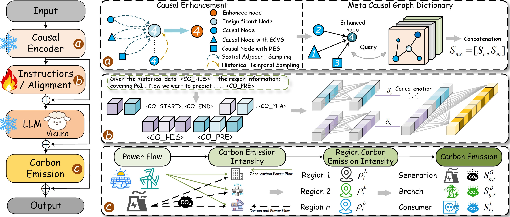

# CarbonGPT: Meta Causal Graph Large Language Models for Carbon Emission Forecasting in Large-scale Power Distribution Networks

Shijie Li, Jiajun Lai, Jing Li, Wenhu Tang, Ying Xue, Huaiguang Jiang*  (*Corresponding author)<br />

[School of Future Technology](https://www2.scut.edu.cn/ft/main.htm), @[South China University of Technology](https://www.scut.edu.cn/en/)

-----

## Abstract

*Carbon emission reduction has emerged as a global core development objective, where dynamic carbon flow perception
serves as the critical foundation for low-carbon dispatch. However, the electrification shift of transportation carbon
emissions caused by large-scale electric vehicle (EV) grid integration, coupled with the grid impact from renewable
energy source (RES) volatility, poses unprecedented challenges for accurate carbon emission prediction. Although
adaptive graphs and large language models (LLMs) can achieve carbon emission prediction for power distribution
networks (PDNs) under data sparsity scenarios, the spurious cross-variable correlations derived from their adaptive
topologies tend to be amplified by LLMs, consequently constraining model learning and reasoning capabilities. To address
this, we propose a novel model named CarbonGPT. This innovative model employs a causal encoder to uncover genuine
cross-variable causal relationships, while incorporating a meta causal graph dictionary and lightweight alignment to
enhance the comprehension of carbon feature representations by LLMs under EV and RES grid integration scenarios.
Extensive simulations in PDNs with high penetration of EVs and RES integration have demonstrated that CarbonGPT
consistently achieves state-of-the-art performance in both prediction accuracy and effectiveness.*



## Introduction of Our Model

* To accurately predict carbon emissions in PDNs under extensive integration of EVCS and RES, we introduce a carbon
  emission LLM (i.e., CarbonGPT), which leverages causal inference to effectively extract real spatio-temporal features
  across variables in sparse data.
* To effectively identify and eliminate spurious cross-variable correlations in the adaptive spatial structure of PDNs,
  we specifically design variable embedding, causal inference, and causal enhancement within the causal encoder. These
  components ensure the preservation of independent variable features while uncovering cross-variable causal
  relationships to guide the LLM in learning the carbon emission patterns of PDNs.
* To fully leverage the powerful LLM in adapting to sparse PDN data and aligning with the continuous value distribution
  of carbon emissions, we introduce a meta causal graph dictionary and lightweight marker alignment. These are designed
  to assist the LLM in understanding the carbon feature representations of PDNs after causal enhancement, based on the
  characteristics of EVCS and RES.
* To closely simulate realistic PDNs under extensive integration of EVCS and RES, we propose the RPTM, which constructs
  a large-scale PTN with high RES penetration through density-based spatial clustering (DSC), dual-network threshold
  fusion, and traffic-to-charge (T2C). The proposed CarbonGPT achieves state-of-the-art (SOTA) performance within the
  PTN.

## Introduction to the PTN

To evaluate the effectiveness of the proposed CarbonGPT in predicting carbon emissions under large-scale integration of
EVCS and RES, we constructed the PTN. Due to legal and privacy protection constraints, acquiring diverse data sources
including PDN structure, long-term PDN load data, RES data, weather data, UTN structure, and long-term traffic flow data
for a specific large-scale region in reality is challenging.

To address this, [researchers](https://ieeexplore.ieee.org/document/10554998) have mapped load data from three feeders
in similar areas to the nodes of three feeders in the IEEE 8500-node test feeder, thereby simulating a real large-scale
PDS based on actual load data. Drawing inspiration from this approach, we utilize the proposed novel RPTM to construct
large-scale RES-integrated PDSs that closely approximate real-world scenarios.

Specifically, RPTM utilizes real winter load
data ([U.S. Building End-Use Load Profiles dataset](https://www.osti.gov/biblio/1576489/)), and combines it with RES
data derived from historical weather data across 22 adjacent small areas in Colorado, USA, where the load dataset is
located. Additionally, government policies, population size, and economic benefits are taken into account. Then, the
long-term datasets (i.e., load and RES) are mapped into
the [IEEE 8500-node test feeder](https://ieeexplore.ieee.org/document/5484381) according to its topology and feeder
information, ensuring that the power at each node meets the requirements of the scenario study. The rooftop PV systems
have a tilt angle of 35°, face south, have
a [loss rate of 10%](https://www.sciencedirect.com/science/article/pii/S0360544216311744), and each system has
a [rated capacity of 10 kW](https://link.springer.com/chapter/10.1007/978-3-031-74244-6_3). The wind turbines are
GE-1.6, each with a rated capacity of 1.5 MW and
a [height of 80 meters](https://www.sciencedirect.com/science/article/pii/S0360544216311811#:~:text=This%20paper%20reports%20the%20first%20international%20validation%20of,NASA%27s%20MERRA%20and%20MERRA-2%20in%2023%20European%20countries.).

Subsequently, based on the constructed PDN, we couple the UTN with it to analyze the impact of electrification
transition on carbon emissions in the UTN. Currently, none of publicly available datasets cover both PDN and UTN
information for the same area. Certain scholars have merged analogous power and traffic systems to create the PTN.
Nevertheless, the resulting system is relatively limited in scale and deviates substantially from real-world PDNs. To
address this issue, this paper selects the IEEE 8500-node test feeder and
the [UTD19](https://www.nature.com/articles/s41598-019-51539-5) dataset as the data sources for the PDN and UTN,
respectively, and fuses them to construct a large-scale PTN.

Specifically, various regions exhibit significant differences in climate conditions, electricity consumption habits,
driving patterns, and EV penetration rates. These factors greatly influence the distribution of load peaks and valleys.
Economically developed regions with mild climates and a significant scale of EV adoption are more representative when
simulating the impact of numerous EVs integrating into the PDN. To ensure the authenticity of the coupled network, we
select traffic flow data from [the Hamburg region in Germany](https://www.nature.com/articles/s41598-019-51539-5). Both
the PDN and the UTN in these regions are characterized by similar economic and climatic conditions. These areas share
comparable EV penetration rates and require substantial heating during winter, leading to high and fluctuating winter
loads. Moreover, there is a noticeable reduction in EV range during winter. Thus, the winter data better represents the
PTN we constructed and facilitates the analysis of the impact of fluctuating EV charging frequencies on the PDN.

By fusing multi-source spatio-temporal information within the designated region as described above, it becomes possible
to construct a large-scale PTN that couples the topological structures of both systems, as shown in the Fig. below.
Additionally, the EVCSs are identified as red intersection points within the PTN. In the data preprocessing phase, we
eliminate PDN loads with lower power that do not conform to the structure of the IEEE-8500 node test feeder.
Subsequently, the samples are allocated to their respective nodes according to the linked feeder from the dataset,
ensuring that the power of each node meets the requirements of the case study. Finally, the principle of closest
proximity is utilized to select the coupling nodes, thereby eliminating any anomalous EVCS.

The data is divided into training, validation, and testing sets using a ratio of 1:1:1. Notably, the RPTM operates
independently from CarbonGPT.


## Simulation Setting

Our simulations utilize the powerful [Vicuna-7B](https://dl.acm.org/doi/abs/10.5555/3666122.3668142) as the foundational
LLM, with the key hyperparameters specified as follows:

| Parameters Description               | Value                    |
|--------------------------------------|--------------------------|
| Optimizer / Precision                | Adam / BFloat16          | 
| Learning rate / Weight decay         | 0.002 / 0.0              |
| $D_d, D_c, D_{tr}$                   | 32, 32C, [18, 12, 6, 3]  |
| $D_s$, $D_v$, $D_b$                  | 64, 4096, 256            |
| $\mathcal{E}$ / $O$                  | 2 / 6                    |
| Random seed / Loss function          | 42 / $\mathcal{L}_{cep}$ |
| Number of attention heads / $\alpha$ | 32 / 12                  |
| Number of hidden layers / $\beta$    | 32 / 12                  |

The detailed hyperparameter settings and the training environment of CarbonGPT can be fully obtained in
the <a href='#Getting Started'>subsequent sections</a>.

The power flow calculations for the PTN are conducted using OpenDSS, which enables hour-level carbon emission analysis.
There are two types of generation: coal-fired units with a capacity of 1 MW and zero-carbon emission units (i.e., PVG
and WG) with a capacity of less than [8 MW](https://ieeexplore.ieee.org/document/7021901). The PTN exhibits a maximum
power demand of approximately 12.46 MW, and a RES penetration rate of 92.5%.
The [CI](https://www.epa.gov/sites/default/files/2020-12/documents/power_plants_2017_industrial_profile_updated_2020.pdf)
for the generation units is as follows:

| Generation Type   | Total Capacity (kW) | CI for Generation Units (kgCO<sub>2/kWh) |
| ----------------- | ------------------- | ---------------------------------------- |
| Coal-fired unit   | 1000                | 0.98883                                  |
| Zero-carbon units | 12370               | 0.01356                                  |

## Getting Started

<span id='all_catelogue'/>

### Table of Contents:

* <a href='#Environment'>1. Environment </a>
* <a href='#Training CarbonGPT'>2. Training CarbonGPT</a>
    * <a href='#Prepare Pre-trained Checkpoint'>2.1. Prepare Pre-trained Checkpoint</a>
    * <a href='#Instruction Tuning'>2.2. Instruction Tuning</a>
* <a href='#Evaluating CarbonGPT'>3. Evaluating CarbonGPT</a>
    * <a href='#Preparing Checkpoints and Data'>3.1. Preparing Checkpoints and Data</a>
    * <a href='#Running Evaluation'>3.2. Running Evaluation</a>
    * <a href='#Evaluation Metric Calculation'>3.3. Evaluation Metric Calculation</a>
* <a href='#Carbon Emission Flow'>4. Carbon Emission Flow</a>
    * <a href='#Code Structure of the Carbon Emission Flow'>4.1. Code Structure of the Carbon Emission Flow</a>
    * <a href='#Environment of the Carbon Emission Flow'>4.2. Environment of the Carbon Emission Flow</a>
    * <a href='#Generate OpenDss Files'>4.3. Generate OpenDss Files</a>
    * <a href='#Run Carbon Emission Flow'>4.4. Run Carbon Emission Flow</a>

<span id='Environment'/>

### 1. Environment

Please first clone the repo and install the required environment, which can be done by running the following commands:

```shell
conda create -n CarbonGPT python=3.9.13

conda activate CarbonGPT

# Torch with CUDA 11.8
pip install torch==2.0.1 torchvision==0.15.2 torchaudio==2.0.2

# To support vicuna base model
pip3 install "fschat[model_worker,webui]"

# To install pyg and pyg-relevant packages
pip install torch_geometric
pip install pyg_lib torch_scatter torch_sparse torch_cluster torch_spline_conv -f https://data.pyg.org/whl/torch-2.0.1+cu118.html

# Clone our CarbonGPT or download it
git clone https://github.com/lishijie15/CarbonGPT.git
cd CarbonGPT

# Install required libraries
# (The recommendation is to install separately using the following method)
pip install deepspeed
pip install ray
pip install einops
pip install wandb
pip install flash-attn==2.3.5
pip install transformers==4.34.0

# （or you can install according to the requirements file.）
pip install -r requirements.txt
```

- All neural networks are implemented using PyTorch and trained on 8 NVIDIA A800 80GB GPUs / 8 NVIDIA H100 80GB GPUs.

<span id='Training CarbonGPT'/>

### 2. Training CarbonGPT

<span id='Prepare Pre-trained Checkpoint'/>

#### 2.1. Preparing Pre-trained Checkpoint

CarbonGPT is trained based on following excellent existing models.
Please follow the instructions to prepare the checkpoints.

- `Vicuna`:
  Prepare our base model Vicuna, which is an instruction-tuned chatbot and base model in our implementation. Please
  download its weights [here](https://github.com/lm-sys/FastChat#model-weights). We generally utilize v1.5 and v1.5-16k
  model with 7B parameters. You should update the 'config.json' of vicuna, for example, the 'config.json' in v1.5-16k
  can be found in [config.json](https://huggingface.co/datasets/bjdwh/checkpoints/blob/main/train_config/config.json)

- `Causal Encoder`:

  we specifically design the lightweight causal inference and intervention mechanism named causal intervention encoder.
  This is integrated with multi-scale temporal feature extraction modules to help the encoder enable the LLM to
  understand and learn complex spatio-temporal evolution patterns. The weights
  of [causal_encoder](./checkpoints/causal_encoder/pretrain_causalencoder.pth) are pre-trained through a typical
  multi-step spatio-temporal prediction task.

- `PTN Data`:

  To evaluate the effectiveness of the proposed model in predicting spatio-temporal patterns across different scenarios,
  we have constructed two distinct scale scenarios. Scenario 1 involves net load forecasting for large-scale PDNs,
  considering the integration of substantial Renewable Energy Sources (RES). Scenario 2 focuses on traffic flow
  prediction, taking into account factors such as crime rates. These data are organized
  in [train_data](./CarbonGPT/ST_data_CarbonGPT/train_data). Please download them and put them at
  ./CarbonGPT/ST_data/train_10pv

<span id='Instruction Tuning'/>

#### 2.2. Instruction Tuning

* **Start tuning:** After the aforementioned steps, you could start the instruction tuning by filling blanks
  at [CarbonGPT_train.sh](./CarbonGPT_train.sh). There is an example as below:

```shell
# to fill in the following path to run our CarbonGPT!
model_path=./checkpoints/vicuna-7b-v1.5-16k
instruct_ds=./ST_data/train_10pv/train_10pv_withUTN.json
st_data_path=./ST_data/train_10pv/train_pv10_withUTN.pkl
pretra_ste=Causal_Encoder
output_model=./checkpoints/Causal_Encoder_7b_pv10

wandb offline
python -m torch.distributed.run --nnodes=1 --nproc_per_node=8 --master_port=20001 \
    CarbonGPT/train/train_power.py \
    --model_name_or_path ${model_path} \
    --version v1 \
    --data_path ${instruct_ds} \
    --st_content ./TAXI.json \
    --st_data_path ${st_data_path} \
    --st_tower ${pretra_ste} \
    --tune_st_mlp_adapter True \
    --st_select_layer -2 \
    --use_st_start_end \
    --bf16 True \
    --output_dir ${output_model} \
    --num_train_epochs 3 \
    --per_device_train_batch_size 4 \
    --per_device_eval_batch_size 4 \
    --gradient_accumulation_steps 1 \
    --evaluation_strategy "no" \
    --save_strategy "steps" \
    --save_steps 4800 \
    --save_total_limit 1 \
    --learning_rate 2e-3 \
    --weight_decay 0. \
    --warmup_ratio 0.03 \
    --lr_scheduler_type "cosine" \
    --logging_steps 1 \
    --tf32 True \
    --model_max_length 2048 \
    --gradient_checkpointing True \
    --lazy_preprocess True \
    --report_to wandb
    
```

<span id='Evaluating CarbonGPT'/>

### 3. Evaluating CarbonGPT

<span id='Preparing Checkpoints and Data'/>

#### 3.1. Preparing Checkpoints and Data

* **Checkpoints:** You could try to evaluate CarbonGPT by using your own model or our released checkpoints.
* **Data:** We split test sets for Scenario 1 and Scenario 2 datasets and make the instruction data for evaluation.
  Please refer to the [evaluating](./CarbonGPT_eval.sh).

<span id='Running Evaluation'/>

#### 3.2. Running Evaluation

You could start the second stage tuning by filling blanks at [CarbonGPT_eval.sh](./CarbonGPT_eval.sh). There is an
example as below:

```shell
# to fill in the following path to evaluation!
output_model=./checkpoints/Causal_Encoder_7b_pv10
datapath=./ST_data/test_10pv/test_10pv_withUTN.json
st_data_path=./ST_data/test_10pv/test_pv10_withUTN.pkl
res_path=./result_test/Causal_Encoder_7b_pv10_
start_id=0
end_id=593208
num_gpus=8

python ./CarbonGPT/eval/test_CarbonGPT.py --model-name ${output_model}  --prompting_file ${datapath} --st_data_path ${st_data_path} --output_res_path ${res_path} --start_id ${start_id} --end_id ${end_id} --num_gpus ${num_gpus}
```

#### 3.3. Evaluation Metric Calculation

<span id='Evaluation Metric Calculation'/>

You can use [result_test.py](./metric_calculation/result_test.py) to calculate the performance metrics of the predicted
results.

<span id='Carbon Emission Flow'/>

### 4. Carbon Emission Flow

<span id='Code Structure of the Carbon Emission Flow'/>

#### 4.1. Code Structure of the Carbon Emission Flow

* **data/JsonData:** Contains the JSON files with load, wind power, and photovoltaic prediction data
* **data/template:** Contains the template files for the OpenDSS files
* **plot:** Contains the plot files
* **Feeders/8500-Node:** Contains the OpenDSS files for the feeders
* **concat data.py:** Concatenates the load, wind power, and photovoltaic prediction data
* **PF_transfer.py:** Sets up the power flow simulation and estimates carbon emissions
* **load_opendss.py:** Generate load-related OpenDSS files based on the template file
* **generate_opendss.py:** Generate Generator-related OpenDSS files based on the template file and run carbon emission
  flow
* **Carbon_new.py:** Estimates carbon emissions

<span id='Environment of the Carbon Emission Flow'/>

#### 4.2. Environment of the Carbon Emission Flow (Restricted to *Windows*)

You could first clone the repo and install the reguired environment, which can be done by running the following
commands.

```shell
conda create -n carbonEmission python-3.11
conda activate carbonEmission
# install the reauired pacxace
pip install py_dss interface pandas numpy
```

<span id='Generate OpenDss Files'/>

#### 4.3. Run Carbon Emission Flow

Please put the json output into the **data/JsonData** folder.

Then, run the following command to estimate carbon emissions flow at specific timestamp:

```shell
python generate_opendss.py -filetype json -pred_or_true pred -index <timestamp>
```
